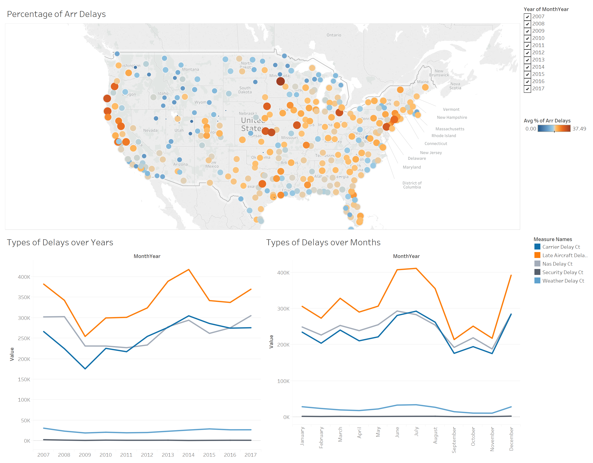
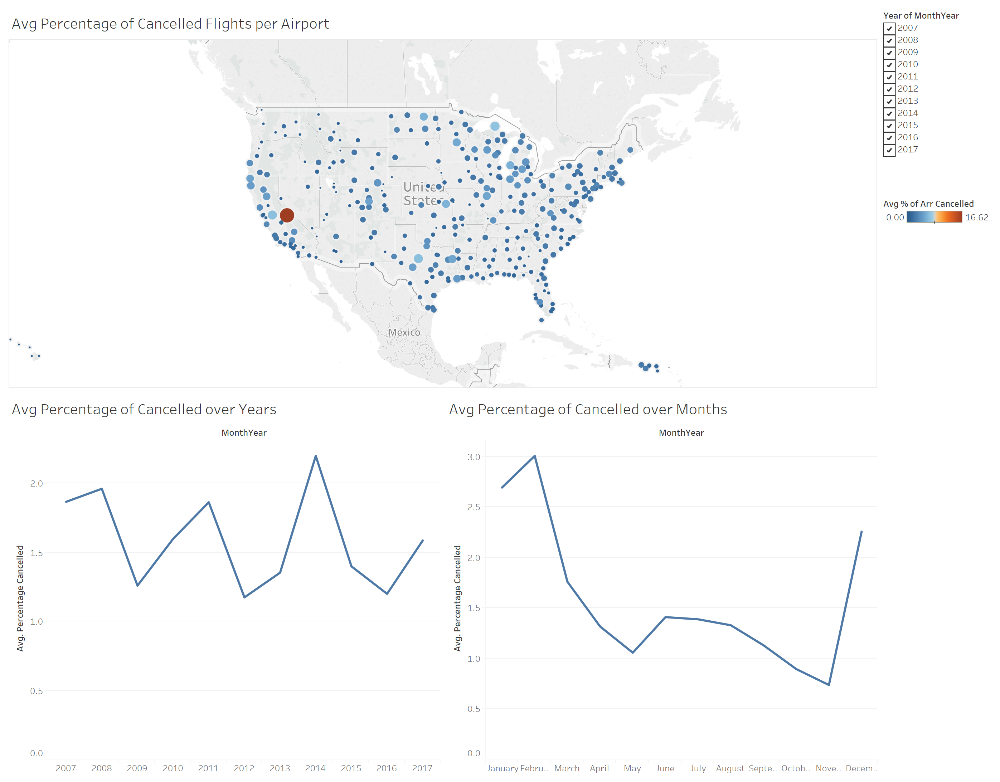
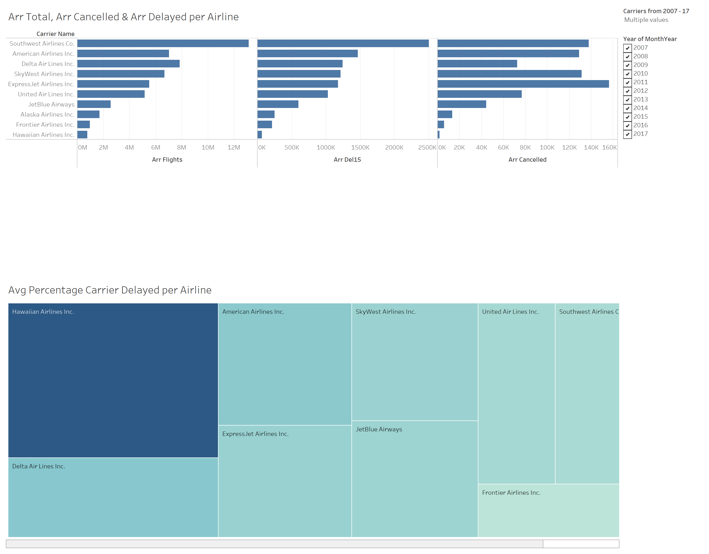
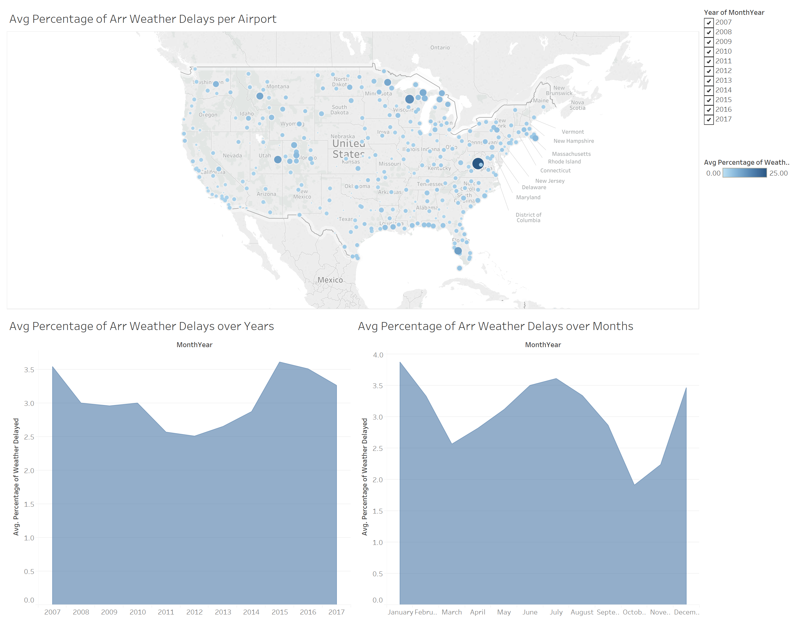

# Arrival Flights Performance for Years 2007 to 2017:

### Link to Tableau story:

https://public.tableau.com/profile/neeharika1405#!/vizhome/FlightsProjectEdited/Story1?publish=yes

## Summary:

This data set is downloaded from RITA website contains information about United States arrival flights delays and performance for years 2007 to 2017. The link to download this set is [here](https://www.transtats.bts.gov/OT_Delay/OT_DelayCause1.asp). 

The questions I tried to answer in Tableau story:

1. The percentage of flight delays for different airports, is delay count increasing or decreasing over years and months?
2. The percentage of cancelled flights for different airports, trend of cancelled flights over years and months?
3. Which carrier has highest percentage of carrier delays for all delays and highest delays and cancellations for major airlines?
4. Which airport has highest percentage of weather delays? Weather delay trend for months?

Description of variables used in this analysis:

* ArrDel15: Arrival Delay Indicator, 15 Minutes or More (1=Yes)
* Carrier Delay Ct: Carrier Delay count, in count (of flights). The cause of the cancellation or delay was due to circumstances within the airline's control
* Weather Delay Ct: Weather Delay count, in count (of flights). Significant meteorological conditions (actual or forecasted)
* Late Aircraft Delay Ct: Late Aircraft count, in count (of flights). A previous flight with same aircraft arrived late, causing the present flight to depart late.
* Nas Delay Ct: Nas Delay count, in count (of flights). Delay Delays and cancellations attributable to the national aviation system
* Security Delay Ct: Security Delay, in count (of flights). Delays or cancellations caused by evacuation of a terminal or concourse, re-boarding of aircraft because of security breach, inoperative screening equipment and/or long lines in excess of 29 minutes at screening areas.

## Design:

I choose maps for three dashboards, because it is the best way to show the data for each airport and for weather delays it helps to understand which cities are affected. The line plots and area plots shows the trend for all the years and months. I used functions in tableau to combine month and year columns and mathematical operators to calculate percentages. 

After the feedback, I made changes in choosing the data as the first analysis is based on delay in minutes which is not correct metric to anlayze the percentage of delays for all the flights. I changed the dashboards based on below feedback. As the feedback is majorly about the data types, I changed the style of the dashboards and discovered new questions to answer.

In the first dashboard, I created map using airport column and ploted percentage of arrival delays using color and size. Percentage of arrival delays are calculated using 'Edit in shelf' in the right click menu of Marks card. To show different types of delays contribution I created line plot for years and months. 


```python
from IPython.display import Image
Image(filename='Dashboard 1-2.png', width=1000, height=1000)
```





The second dashboard is made using the same methods as above, but the data used is about arrival cancelled flights. 


```python
Image(filename='Dashboard 2.png', width=1000, height=1000)
```





In the third dashboard, the airlines which are there for years 2007 to 2017 are choosen. The total number of flights, delays and cancellations of each airlines are shown using bar plots. The box plot is used to show the percentage of carrier delay in overall delays. The percentage of carrier delay column is calculated using 'Calculated field' option.


```python
Image(filename='Dashboard 3.png', width=1000, height=1000)
```





Final dashboard in the story shows the weather delay percentage for airport in map. Area plot is used to show the trend of average percentage of weather delays for years and months.


```python
Image(filename='Dashboard 4.png', width=1000, height=1000)
```





## Feedback:

### Link to Final Tableau story:

 https://public.tableau.com/profile/neeharika1405#!/vizhome/FlightsProjectEdited/Story1?publish=yes
 
* Link to the first tableau story : https://public.tableau.com/profile/neeharika1405#!/vizhome/FlightsProject_3/Story1?publish=yes
* For dashboard 1, to remove the colors for measure names in map, as its not clear to understand the delays per airport. And to calculate delay percentage using arrival delay count and total number of flights.
* For dashboard 2, to use the delay count instead of minutes. 
* For dashboard 3, again to calculate the weather pproportion in over all delays using count.
* For dashboard 4,suggested to remove it, as the same data can be seen in first dashboard. 

## Resources:

* https://community.tableau.com/thread/230510
* https://www.bts.gov/topics/airlines-and-airports/understanding-reporting-causes-flight-delays-and-cancellations


```python
from IPython.display import HTML

HTML('''<script>
code_show=true; 
function code_toggle() {
 if (code_show){
 $('div.input').hide();
 } else {
 $('div.input').show();
 }
 code_show = !code_show
} 
$( document ).ready(code_toggle);
</script>
<form action="javascript:code_toggle()"><input type="submit" value="Click here to toggle on/off the raw code."></form>''')
```


<script>
code_show=true; 
function code_toggle() {
 if (code_show){
 $('div.input').hide();
 } else {
 $('div.input').show();
 }
 code_show = !code_show
} 
$( document ).ready(code_toggle);
</script>
<form action="javascript:code_toggle()"><input type="submit" value="Click here to toggle on/off the raw code."></form>


